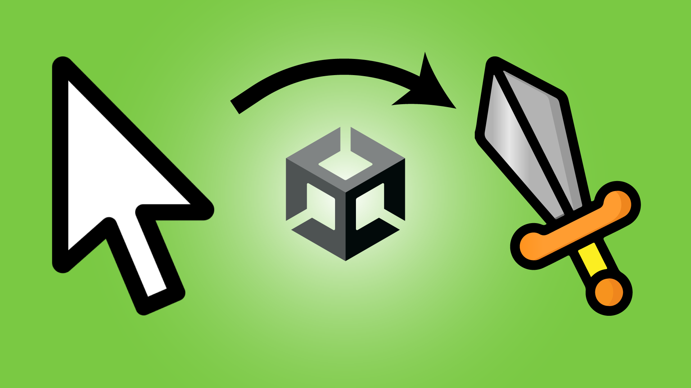

# Mauszeiger in Unity ändern

in diesem Video lernst du, wie du deinen Mauszeiger in Unity ändern kannst und wie du deinem Spieler die Möglichkeit gibst, selber zu entscheiden welchen Mauszeiger er verwenden möchte!

- [🎬 YT Tutorial](https://youtu.be/vj5rE7IhtnM)
- [💬 Joint unserem Discord Server](https://discord.gg/cY5RW7D95u)
- [👍 Abonniert um keine Videos zu verpassen](https://www.youtube.com/@prezipgames)

## Viel Spaß beim Entwickeln!
